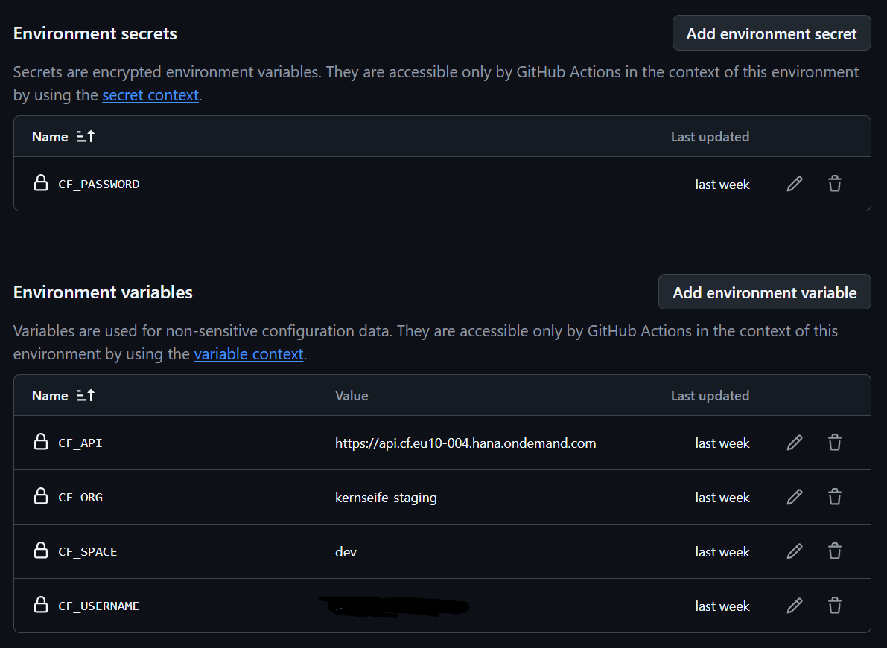
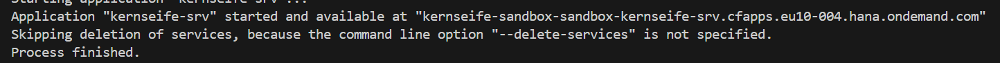

# Kernseife BTP App Installation Guide

## Prerequisits

### Required BTP Resources
- BTP Sub-Account with Cloud Foundry enabled
- min. 2 GB of Application Runtime
- A *HANA Cloud* instance which can be used for a HDI Container

### Required Subscriptions
- SAP Build Work Zone, standard edition  Plan: Standard (Application)

### Required Services
| Service Name | Technical Name | Plan | Note |
|--------------|----------------|------|------|
| SAP HANA Schemas & HDI Containers | `hana` | hdi-shared | - |
| Authorization and Trust Management Service | `xsuaa` | application | Always Free |
| HTML5 Application Repository Service | `html5-apps-repo` | app-host | Always Free |
| Destination Service | `destination` | lite | Always Free |
| Application Autoscaler | `autoscaler` | standard | Always Free |
| Cloud Logging | `cloud-logging` | dev | Use "standard" plan for Production |

> 💡 While the legacy Application Logging Service is supported, we recommend using Cloud Logging as it's the strategic successor. Learn more in this [SAP Community Blog Post](https://community.sap.com/t5/technology-blog-posts-by-sap/from-application-logging-to-cloud-logging-service-innovation-guide/ba-p/13938380).


## Build & Deploy

1. Login to your CF CLI
2. Install dependencies and build:
   ```bash
   npm install
   npm run mbt
   ```
3. Choose your deployment target:

   For development:
     ```bash
     npm run deploy-dev
     ```
   For production:
     ```bash
     npm run deploy-prod
     ```

> [!NOTE]
> These differentiate between the mta parameters usind a different db service name (to easily spot production tenants, which.. helps not deleting
> those by accident).
> Also production tenants use different service plans (e.g. standard in  cloud-logging).
> Feel free to check and adjust that in your .mtaext files.


### GitHub Actions Deployment
We provide a GitHub Actions workflow for automated builds and deployments following [CAP's continuous deployment guidelines](https://cap.cloud.sap/docs/releases/aug25#continuous-deployments).

Required GitHub Environment Setup:


Successful Deployment Example:


### Post-Deployment Setup
Assign your user to the role `kernseife-admin-${space}` (space name dependent)

## SAP Build Work Zone Configuration
As we don't use a standalone approuter we use the integrated one inside workzone.
Technically you can also use a standalone approuter and a launchpad, but we suggest using workzone as it makes all the role, tile, etc. management way easier.
If your BTP Subaccount doesn't have a Workzone Subscription already, you need to add it.
Make sure your Subbaccount as the Plan "standard (Application)" and not "standard" assigned.
Step 1 of this Guide explains it nicely:
https://developers.sap.com/tutorials/spa-configure-workzone..html

> [!NOTE]
> If you don't have a custom IdP Tenant, I suggest getting one, otherwise the Workzone Subscription might fail.
> As a customer/partner I don't think you can even have a BTP Account without one anyway. Feel free to correct me on this.

### Setup Steps
1. Create new Site in Work Zone
2. Update HTML5 App Repository in Channel Manager
3. Import Kernseife Apps from Content Explorer
4. Configure Roles (recommended over "Everyone" role)
   - Create custom role 
   - Assign apps to role
   - Link role to site via Site Studio => Role Assignments

Don't forget to assign your user to that role. Otherwise you will wonder for hours why you can't see any apps. True story.

Feel free to now define Groups and assign Apps to them.


Congratulations, you should now be able to use your Kernseife BTP Tenant!

## Initial Kernseife Setup


